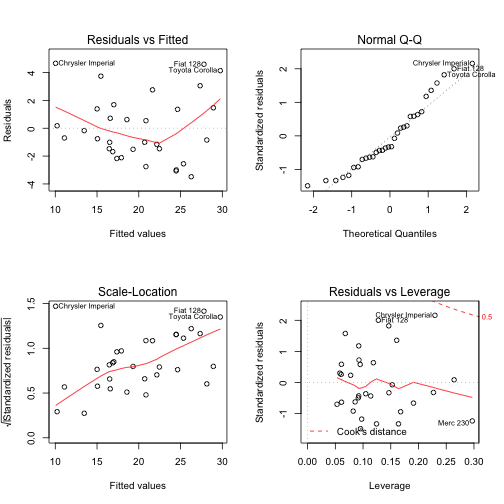

# Context

You work for *Motor Trend*, a magazine about the automobile industry. Looking at a data set of a collection of cars, they are interested in exploring the relationship between a set of variables and miles per gallon (MPG) (outcome). They are particularly interested in the following two questions:

- "Is an automatic or manual transmission better for MPG"
- "Quantify the MPG difference between automatic and manual transmissions""

# Executive Summary

From the analysis on the `mtcars` dataset, we can conclude that manual transmission is better for MPG than automatic transmission and on average manual transmission cars have 2.94 MPGs more than automatic transmission cars.

# Analysis process

## Data description

The data was extracted from the 1974 Motor Trend US magazine, and comprises fuel consumption and 10 aspects of automobile design and performance for 32 automobiles (1973–74 models).

## Data preparation


```r
# load data
library(datasets)
data(mtcars)
# change "transmission type" variable to categorical variable
mtcars$am <- factor(mtcars$am, labels = c("Automatic", "Manual"))
```

## Exploratory Data Analysis

We first check the normality of the `mpg` variable in order to create a linear regression model. The result shows that the distribution of `mpg` is approximately normal.
Next from the boxplot showing the relationship between mpg and transmission type, manual transmission seems to have better mpg compared with automatic transmission. We will dig deeper into this statement with upcoming analysis.


## Linear regression model

First we consider linear regression model based only on the variable `am`.


```r
am.fit <- lm(mpg ~ am, data=mtcars)
summary(am.fit)
```

```
## 
## Call:
## lm(formula = mpg ~ am, data = mtcars)
## 
## Residuals:
##    Min     1Q Median     3Q    Max 
## -9.392 -3.092 -0.297  3.244  9.508 
## 
## Coefficients:
##             Estimate Std. Error t value Pr(>|t|)    
## (Intercept)    17.15       1.12   15.25  1.1e-15 ***
## amManual        7.24       1.76    4.11  0.00029 ***
## ---
## Signif. codes:  0 '***' 0.001 '**' 0.01 '*' 0.05 '.' 0.1 ' ' 1
## 
## Residual standard error: 4.9 on 30 degrees of freedom
## Multiple R-squared:  0.36,	Adjusted R-squared:  0.338 
## F-statistic: 16.9 on 1 and 30 DF,  p-value: 0.000285
```

On average manual transmission cars have 7.245 MPGs more than automatic transmission. However this model's fitting ability is rather low (R-squared value is only 0.36).

So next we consider all variables which can explain `mpg` by using multiple regression models. We use R's `step` function for the purpose of variable selection.


```r
mul.fit <- step(lm(mpg ~ ., data=mtcars), direction = "both", trace=FALSE)
summary(mul.fit)
```

```
## 
## Call:
## lm(formula = mpg ~ wt + qsec + am, data = mtcars)
## 
## Residuals:
##    Min     1Q Median     3Q    Max 
## -3.481 -1.556 -0.726  1.411  4.661 
## 
## Coefficients:
##             Estimate Std. Error t value Pr(>|t|)    
## (Intercept)    9.618      6.960    1.38  0.17792    
## wt            -3.917      0.711   -5.51    7e-06 ***
## qsec           1.226      0.289    4.25  0.00022 ***
## amManual       2.936      1.411    2.08  0.04672 *  
## ---
## Signif. codes:  0 '***' 0.001 '**' 0.01 '*' 0.05 '.' 0.1 ' ' 1
## 
## Residual standard error: 2.46 on 28 degrees of freedom
## Multiple R-squared:  0.85,	Adjusted R-squared:  0.834 
## F-statistic: 52.7 on 3 and 28 DF,  p-value: 1.21e-11
```

We can see that this model's R-squared value (0.85) increases significantly compared to the single linear regression above, showing a high fitting ability.

To confirm the difference between these two models, let us do the variance analysis.


```r
anova(am.fit, mul.fit)
```

```
## Analysis of Variance Table
## 
## Model 1: mpg ~ am
## Model 2: mpg ~ wt + qsec + am
##   Res.Df RSS Df Sum of Sq    F  Pr(>F)    
## 1     30 721                              
## 2     28 169  2       552 45.6 1.6e-09 ***
## ---
## Signif. codes:  0 '***' 0.001 '**' 0.01 '*' 0.05 '.' 0.1 ' ' 1
```

With a p-value of 1.5505 &times; 10<sup>-9</sup>, we reject the null hypothesis and claim that our multiple regression model is significantly different from the single variable model.

Also from the result in the Appendix, our best model's residuals show normality and there is no evidence of heteroskedasticity.

To our conclusion, with our best model, on average manual transmission cars have 2.94 MPGs more than automatic transmission cars.

# Appendix

## Exploratory data analysis result

```r
par(mfrow = c(1,3))
plot(density(mtcars$mpg), xlab="MPG", main="Density plot of MPG")
plot(mpg ~ am, data=mtcars, main="MPG by transmission type",
     xlab="Transmission type", ylab="MPG")
```

 

## Residual diagnostics for best multiple regression model

```r
par(mfrow = c(2,2))
plot(mul.fit)
```

 
